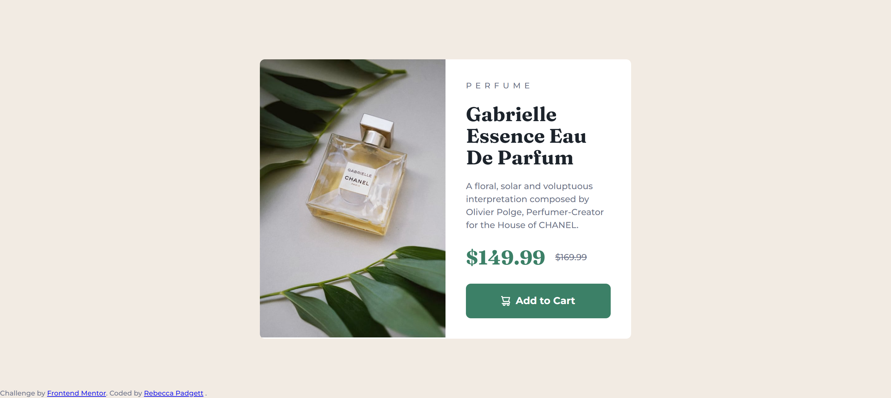

# Frontend Mentor - Product preview card component solution

This is a solution to the [Product preview card component challenge on Frontend Mentor](https://www.frontendmentor.io/challenges/product-preview-card-component-GO7UmttRfa). Frontend Mentor challenges help you improve your coding skills by building realistic projects.

## Table of contents

- [Overview](#overview)
  - [The challenge](#the-challenge)
  - [Screenshot](#screenshot)
  - [Links](#links)
- [My process](#my-process)
  - [Built with](#built-with)
  - [What I learned](#what-i-learned)
  - [Continued development](#continued-development)
  - [Useful resources](#useful-resources)
- [Author](#author)
- [Acknowledgments](#acknowledgments)

## Overview

### The challenge

Users should be able to:

- View the optimal layout depending on their device's screen size
- See hover and focus states for interactive elements

### Screenshot

| Mobile                                            | Desktop                                            |
| ------------------------------------------------- | -------------------------------------------------- |
|  |  |

### Links

- Solution URL: [Frontend Mentor](https://www.frontendmentor.io/solutions/product-preview-card-component-using-flexbox-and-css-grid-L-BFNj7CL7)
- Live Site URL: [Github Pages](https://bccpadge.github.io/product-preview-card-component/)

## My process

### Built with

- Semantic HTML5 markup
- CSS custom properties
- Flexbox
- CSS Grid
- Mobile-first workflow

### What I learned

I implemented the visually hidden technique to allow content to be hidden for sighted users while be available for ATs to discover and interact with the content.

```css
.visually-hidden:not(:focus):not(:active) {
  clip: rect(0 0 0 0);
  clip-path: inset(50%);
  height: 1px;
  overflow: hidden;
  position: absolute;
  white-space: nowrap;
  width: 1px;
}
```

### Continued development

I want to continue learning more about web accessibility while builing these projects.

### Useful resources

- [visually hidden](https://www.scottohara.me/blog/2017/04/14/inclusively-hidden.html) - I used the visually hidden class on the price group to help differentiate the current price and orginal price for screen readers. I really liked this pattern and will use it going forward.

## Author

- Frontend Mentor - [@bccpadge](https://www.frontendmentor.io/profile/bccpadge)
- Twitter - [@bccpadge](https://www.twitter.com/bccpadge)

## Acknowledgments

[Kevin Powell's Youtube video](https://www.youtube.com/watch?v=B2WL6KkqhLQ)
